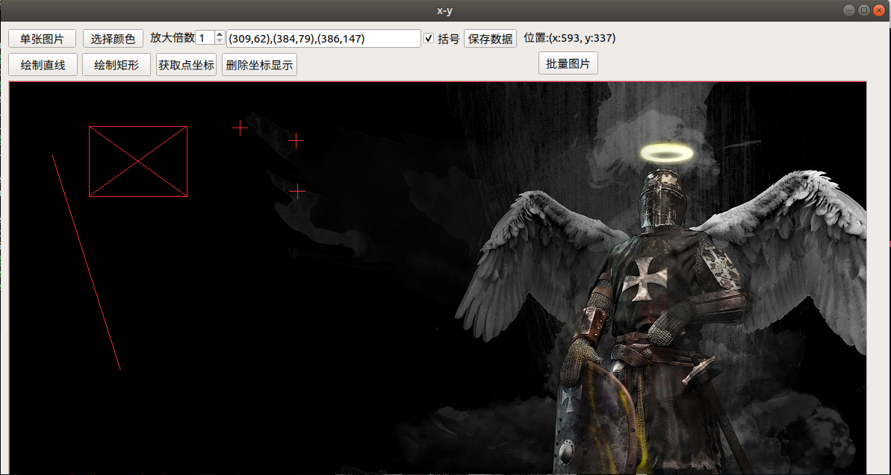

## 一、简介
  
　　x-y是一款用于获取图片上的点的像素坐标的软件，简单易用，跨平台，
选点精度达到像素级。  
　　开发这个项目的因为一个项目中需要过得图片某些点的坐标，手动去标非
常麻烦，Ubuntu下也没有类似的工具，于是决定自己开发一个来使用。

## 二、安装
  
* Windows
  * 点击[下载](https://github.com/Mannix1994/PointsPicker/releases/download/V1.0/x-y.setup.exe)下载软件，安装即可运行。

* Linux
    *  Ubuntu、Debian、Mint、Deepin均测试通过。系统要求为64位系统。
    *  方法1、点击[下载](https://github.com/Mannix1994/PointsPicker/releases/download/V1.0/x-y-x86_64.AppImage)
下载软件，然后：
	```
    # 添加运行权限
	chmod +x x-y-x86_64.AppImage
	# 运行
    ./x-y-x86_64.AppImage
	# 也可双击运行
	```
* 其他Linux发行版
  * 其他Linux发行版，可下载[源代码](https://gitee.com/Mannix1994/x-y/raw/master/res/src.zip)并使用Qt编译运行。


## 三、使用指南
  
* 目录结构
```
bin   安装文件
build 尚未打包的软件
res   资源文件
src   项目源码
```
* 概念定义
  * 定位十字：定位十字是当鼠标左键点击时，会在图片上画一个小十字，把这个
称为定位十字。
  * 追踪十字：鼠标在图片上滑动时，会在图片上画一个很大的十字，这个十字跟
着鼠标动，把这个十字称为追踪十字。  

* 使用方法
  * 打开软件后，点击“选择图片”按钮可以从电脑中选取图片，选取图片后，会将图
片载入到软件中。
  * 移动鼠标，追踪十字就会跟着鼠标动，在想要取坐标的地方，单击鼠标左键或者
回车键，会在点击的点绘制一个定位十字，并讲该点坐标显示到编辑框里面；单击鼠
标右键，会删除上一个选取的点。
  * 当窗口被激活(随意点击窗口的任意位置)，按‘W’、‘A’、‘S’、‘D’可以微调
追踪十字的坐标，微调完成后，单击回车键记录坐标。
  * 单击“选择颜色”按钮，可以修改追踪十字和定位十字的颜色。
  * 坐标选取完成后，在编辑框中可复制选取的坐标。
  * 当图片比较大时，可以使用鼠标滚轮上下滑动图片；按住“Ctrl”键时，滑动鼠标
滚轮可左右滑动图片。
  * 按“Shift”键，可显示或者隐藏滑动条。
  * “放大倍数”选项可以放大或者缩小图片。

* 软件截图


## 四、问题反馈
  
可打开一个issue，在里面反馈问题。

## 五、关于作者

```javascript
  var whoAmI = {
    name   : "Mannix1994",
    gitee  : "https://gitee.com/Mannix1994",
    github : "https://github.com/Mannix1994"
  }
```
